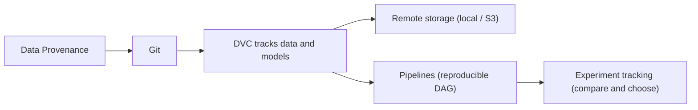
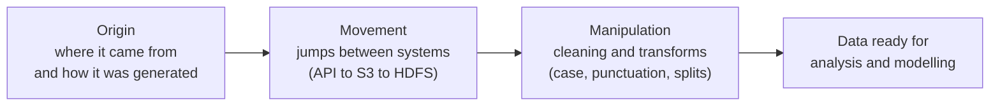
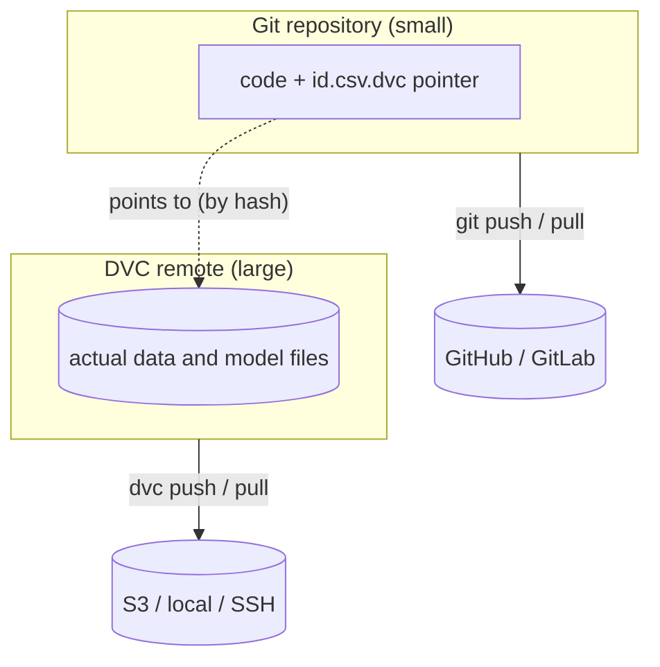
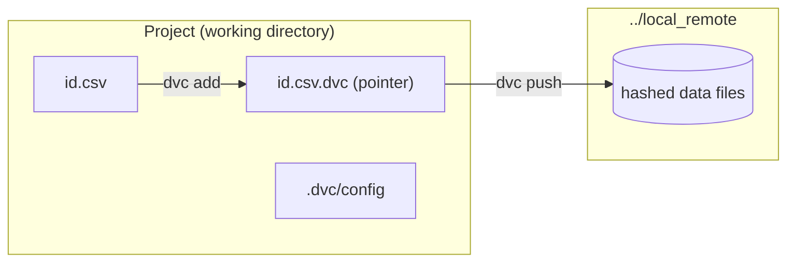
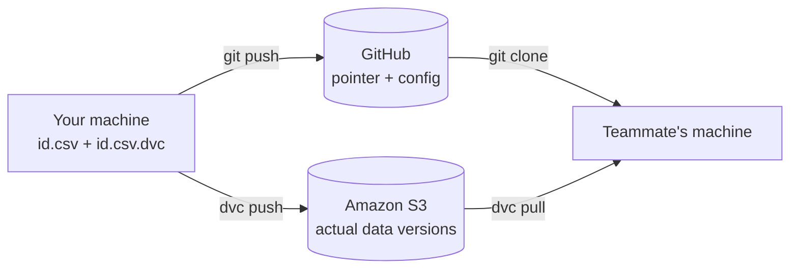
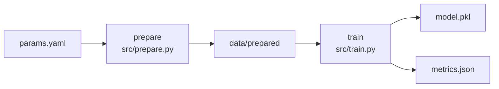
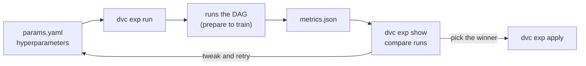

# Data and Model Version Control (DMVC)

DMVC provides us a way to easily store and track both our data and models, even when they go beyond the size limits of a typical code repository. We will also learn DVC's functionality for creating pipelines and tracking experiments.

> **Definition.** Data and Model Version Control is the practice of recording, storing, and retrieving specific versions of datasets and trained models alongside the code that produced them, so that any past result can be reconstructed exactly. It extends the idea of source-code version control to the two artefacts that ordinary code repositories cannot hold well: large data files and model binaries.

**Why it matters.** Code is the easy part of a machine learning project. The harder problem is that a result depends on three moving things at once: the code, the exact data it was trained on, and the parameters used. If a teammate quietly filters a few rows out of a 10 GB training file, Git only sees an unchanged pointer, and your "reproducible" experiment silently produces a different model. DMVC closes that gap by making data and models first-class, versioned citizens of the project.

## Contents

- Data Provenance
- Review of Git
- Data Version Control (DVC)
- Remote Storage with DVC
- Pipelines with DVC
- Experiment Tracking with DVC

The six topics are not independent. They build on one another, from understanding where data comes from, through versioning it, to running and comparing reproducible experiments on top of it.



---

## Data Provenance

> **Definition.** Data provenance is the complete origin, movement, and manipulation of data, that is, the full documented history of where a dataset came from and everything that has happened to it since.

**Data provenance** is the complete origin, movement, and manipulation of data.

- **Origin** can include not only where the data was retrieved from, but also how the dataset was generated. For example, Census data may be retrieved from an API and originally collected by the American Community Survey in a particular year.
- **Movement** may not always apply, but when it does it would encompass data that you or your team received from someone else. In other words, it is the origin plus any other jumps the data has made, for example data pulled from an API and moved to a company's S3 bucket for storage only to later be moved to HDFS for analysis.
- **Manipulation.** Data may come to you completely raw, and then the manipulation will be any transforms or alterations you do on the data. Alternatively, data may come to you in a baked form and the various transformations will ideally be documented. A common example in NLP is documentation on how a dataset is processed, such as by changing the case or removing numbers or punctuation.

**Real-life example.** Think of provenance the way a supermarket thinks of food traceability. A carton of eggs carries a story: the farm it came from (origin), the distribution centres and trucks it passed through (movement), and any grading, washing, or packing applied along the way (manipulation). If a contamination issue arises, that recorded history lets you trace the exact batch. A dataset deserves the same traceability, so that when a model misbehaves you can trace which version of which data, transformed in which way, produced it.



Provenance is the conceptual motivation for everything that follows. The tools below, Git first and then DVC, are how we record that history in practice rather than in a notebook somewhere.

---

## Review of Git

> **Definition.** Git is a distributed version control system that records changes to files over time, lets you keep and switch between multiple versions through branches, and supports both solo and collaborative work.

**Git** is software used to **track changes** to files, manage multiple versions of files and directories using **branches**, and is well-suited for both **solo** and **collaborative work**. Git at its simplest is a CLI program, but is often used in conjunction with platforms such as GitHub and GitLab which provide additional features such as project hosting, collaboration tools, GUIs, and CI/CD (see the next lesson for more).

**Real-life example.** Git is like the version history in a shared document, except you decide exactly when a snapshot is taken and you can label, branch, and merge those snapshots deliberately. You might keep a stable `main` version while experimenting on a `feature` branch, then merge the experiment back once it works.

A minimal Git session looks like this:

```bash
git init                       # start tracking this folder
git add .                      # stage the current changes
git commit -m "Initial commit" # record a snapshot
git branch experiment          # create a separate line of work
git checkout experiment        # switch to it
```

The limitation that motivates DVC is simple. Git was designed for text-sized code, not for multi-gigabyte datasets or model binaries. We need something that brings Git's discipline to large artefacts without stuffing them into the Git history itself.

---

## Data Version Control (DVC)

> **Definition.** DVC is an open-source tool that brings Git-style versioning to datasets, models, and the workflow that turns one into the other, while delegating the actual version history to Git and storing the large files elsewhere.

**Data Version Control (DVC)** is a complete solution for managing data, models, and the process of going from data to model. All the while, it integrates seamlessly with tools that we already use (or intend to use) such as Git and Continuous Integration/Continuous Deployment (CI/CD).

DVC's name is a bit of a misnomer in that it goes well beyond versioning data, and technically it does not even version data at all. Instead, it uses Git for the actual versioning. DVC leverages a **remote storage** to hold the data but then tracks a small metadata file using Git (for example, `id.csv.dvc`).

Beyond data versioning, DVC is a full **experiment management** system through its **pipeline** functionality. In DVC you can define a reusable pipeline (which is also version controlled). These pipelines can be used to build a reproducible model workflow and can be written so experiments can be logged and compared to help choose the best model for deployment.

**The key mental model.** This single picture is what makes DVC click. Git holds a tiny pointer file that records a hash of your data; the heavy data itself lives in DVC's remote storage. Git stays small and fast, while the real bytes are stored and shared separately.



**Real-life example.** Think of an IKEA flat-pack. The Git repository is the small assembly leaflet: lightweight, easy to email, and it tells you precisely which parts you need. The DVC remote is the warehouse holding the bulky timber panels. You would never post the panels with the leaflet; you reference them and collect them from the warehouse on demand. DVC works the same way, keeping the bulky data out of Git but perfectly referenced by it.

DVC's commands are designed to be very similar to Git's, which is what makes it intuitive to adopt.

| Action | Git (for code) | DVC (for data and models) |
| --- | --- | --- |
| Initialise a project | `git init` | `dvc init` |
| Start tracking | `git add` | `dvc add` |
| Record a snapshot | `git commit` | `dvc commit` (rarely needed directly) |
| Upload to remote | `git push` | `dvc push` |
| Download from remote | `git pull` | `dvc pull` |

Assuming you have installed `dvc`, you can initialise a project using `git init` followed by `dvc init`.

To add code or data use `git add` or `dvc add`, respectively. Typically, after a `dvc add` it will then prompt you to `git commit` the corresponding `.dvc` file that has been generated. There is a `dvc commit`, but it is not used in the same way as with `git commit`.

Lastly, there is `git push` and `git pull` and their equivalents of `dvc push` and `dvc pull`. DVC's push and pull are for uploading and downloading data from your remote store specified in the DVC configuration, whereas Git is for sending changes to your remote repository or bringing in any changes.

**Installation.** DVC is a Python package. Install the base tool, and add the S3 extra later when you reach remote storage on AWS.

```bash
pip install dvc          # base install
pip install 'dvc[s3]'    # adds the Amazon S3 backend (used later)
```

---

### Tracking Data with DVC Locally

To get comfortable with DVC we will start by creating the seemingly paradoxical **local remote**. This is a remote store in that it is not in our main development folder, but it resides elsewhere on our machine, hence local.

> **Definition.** A *local remote* is DVC remote storage that happens to live on the same machine, for example another directory on your disk. The word *remote* refers to its role (a store separate from your working project), not to its location.

To create it, simply make the folder and tell DVC it is your remote:

```bash
mkdir /local/remote
dvc remote add -d localremote /local/remote
```

This will then create a change to DVC's configuration file located at `.dvc/config` that must be tracked using Git. The `-d` flag marks this remote as the *default*, so `dvc push` and `dvc pull` use it automatically.

To send data to our local remote use `dvc push`. Since this remote is local it is trivial to then explore the structure of how DVC stores the data using your trusty command line tools.

To view available remotes use `dvc remote list`. If you want to make changes or rename a remote then use `dvc remote modify` and `dvc remote rename`, respectively.



#### Task

- Create a folder outside of your current working directory and set it as your local "remote" storage.
- A Python script named `exercise_func.py` is provided. Run the script to generate a CSV file containing a list of identifiers (e.g. 1 to 10).
- Track the generated file using DVC and push it to your local remote. Re-run the script, but this time double the number of identifiers. Then track and push the newly updated CSV file. Optionally, explore the created `.dvc` file and observe how it changes when you update the tracked CSV.

**Step 1. Set up the repository and local remote.**

```bash
git init
dvc init
mkdir ../local_remote
dvc remote add -d localremote ../local_remote
```

**Step 2. The script that generates the CSV, `exercise_func.py`.**

```python
import sys

import pandas as pd


def create_ids(id_count: str) -> None:
    """Generate a list of IDs and save it as a csv."""
    ids = [i for i in range(int(id_count))]
    df = pd.DataFrame(ids)
    df.to_csv("./id.csv", index=False)


if __name__ == "__main__":
    create_ids(sys.argv[1])
```

> **Note on the identifiers.** `range(int(id_count))` produces values from `0` to `id_count - 1`, so calling the script with `10` yields the identifiers `0` to `9`. If you want them to read `1` to `10` instead, change the comprehension to `ids = [i for i in range(1, int(id_count) + 1)]`. The original behaviour is kept above; the choice does not affect how DVC tracks the file.

**Step 3. Generate the data, then track and push it.**

```bash
python ./exercise_func.py 10        # creates id.csv with 10 rows
dvc add id.csv                      # DVC starts tracking it, creates id.csv.dvc
git add .gitignore id.csv.dvc       # commit the pointer, not the data
git commit -m "Initial commit of tracked id.csv"
dvc push                            # send the data to the local remote
```

**Step 4. Update the data, then track and push again.**

```bash
python ./exercise_func.py 20        # double the identifiers
dvc add id.csv                      # DVC notices the change, updates the pointer
git add id.csv.dvc
git commit -m "Update id.csv to 20 identifiers"
dvc push                            # send the new version to the remote
```

**Exploring the `.dvc` file.** Open `id.csv.dvc` after each `dvc add`. It is a tiny human-readable YAML pointer, something like this:

```yaml
outs:
- md5: 91b06c2e0e10dc5e2d97f87fdcca3f43
  size: 22
  hash: md5
  path: id.csv
```

The `md5` hash is the fingerprint of the data's contents. When you doubled the identifiers and re-ran `dvc add`, the contents changed, so the hash changed, and Git recorded a new pointer. That is the whole trick: Git versions a 22-byte fingerprint while DVC moves the real file to the remote.

---

### Remote Storage with DVC

DVC can be used entirely locally, and that is a great way to learn it. But the true power of DVC is unlocked when you set up **remote storage** for your project.

> **Definition.** A DVC *remote* is a shared storage location (cloud object storage such as Amazon S3, an SSH server, network-attached storage, or a local directory) where the versioned data and model files actually live, separate from the Git repository that tracks their pointers.

Remote storage enables you to use the same data and models regardless of what machine you are working on, and allows you to easily share data and models with others. In other words, it makes sharing code and models as easy as it is to `git clone` a repository.

DVC conveniently provides a multitude of ways to retrieve remotely tracked data and models. This enables one to pull in data while working outside of a DVC project, or to easily **pull data into the environment** where a model may be deployed, such as a cloud server or container.

**Real-life example.** A local remote is like keeping a backup on an external hard drive on your desk: fine for you, useless for a teammate overseas. A cloud remote such as S3 is the shared drive in the sky. Anyone with permission can clone the lightweight Git repo and run `dvc pull` to fetch exactly the right data version, no matter which machine they are on.

#### Remote Storage with Amazon S3

The task here mirrors the local exercise, but the remote now lives in the cloud on AWS S3 instead of a folder on your disk.

> **⚠️ Cost flag.** Amazon S3 is a paid service. Storage is billed per gigabyte-month and there are small per-request charges. The AWS Free Tier includes 5 GB of S3 storage for the first 12 months, which is more than enough for this exercise, but you should still tear down afterwards to avoid lingering charges. Verify current pricing on the AWS S3 pricing page before proceeding, as rates change.

**Step 1. Install the S3 backend.**

```bash
pip install 'dvc[s3]'
```

**Step 2. Configure AWS credentials safely (keep secrets out of code).**

DVC authenticates using the standard AWS credential chain, so you never put keys in code or in Git. The cleanest approach is the AWS CLI:

```bash
pip install awscli
aws configure   # prompts for Access Key, Secret Key, region; writes ~/.aws/credentials
```

DVC will then read those credentials automatically. The credential chain it follows is, in order: environment variables (`AWS_ACCESS_KEY_ID`, `AWS_SECRET_ACCESS_KEY`), the shared credentials file (`~/.aws/credentials`), the AWS config file, and finally an IAM role attached to an EC2 instance or container. As a best practice, create a dedicated IAM user whose policy grants access only to the single bucket you use as a DVC remote, with the permissions `s3:ListBucket`, `s3:GetObject`, `s3:PutObject`, and `s3:DeleteObject`.

If you ever must store a per-user credential setting inside the project, use the `--local` flag so it is written to `.dvc/config.local`, which is Git-ignored and therefore never leaks secrets:

```bash
dvc remote modify --local storage credentialpath ~/.aws/credentials
```

**Step 3. Create the S3 remote and commit the config.**

```bash
# create a bucket first (one-off), then point DVC at it
aws s3 mb s3://my-dvc-store

dvc remote add -d storage s3://my-dvc-store/project-data
git add .dvc/config
git commit -m "Configure S3 remote storage"
```

**Step 4. Run the same tracking task as before, now against S3.**

```bash
python ./exercise_func.py 10
dvc add id.csv
git add .gitignore id.csv.dvc
git commit -m "Track id.csv against S3 remote"
dvc push          # uploads to s3://my-dvc-store/project-data

python ./exercise_func.py 20
dvc add id.csv
git add id.csv.dvc
git commit -m "Update id.csv to 20 identifiers"
dvc push          # uploads the new version to S3
```

**Step 5. Verify, then tear down to avoid cost.**

```bash
dvc remote list              # confirm the remote is registered
aws s3 ls s3://my-dvc-store/project-data --recursive   # see the hashed objects

# teardown when finished
aws s3 rm s3://my-dvc-store --recursive
aws s3 rb s3://my-dvc-store
```



The diagram captures the payoff. Code and pointers travel through Git to GitHub; the real data travels through DVC to S3; and a teammate reconstructs the exact state with one `git clone` and one `dvc pull`.

---

## Pipelines with DVC

> **Definition.** A DVC *pipeline* is a versioned, reproducible sequence of stages, where each stage declares its dependencies (input data and scripts), its parameters, its outputs, and the command that runs it. DVC links the stages into a directed acyclic graph (DAG) and re-runs only the parts whose inputs have changed.

**Why it matters.** A pipeline turns a fragile chain of `python preprocess.py && python train.py` shell commands into a declarative graph that DVC can reason about. When you change one parameter, DVC knows precisely which stages are now stale and reruns only those, reusing cached results for the rest. This is what makes results reproducible months later and saves hours of needless recomputation.

**Real-life example.** A pipeline is like a recipe written as a dependency chart rather than a wall of prose. "Make icing" depends on "beat butter and sugar"; "decorate" depends on both the baked cake and the icing. If you only change the icing colour, you do not re-bake the cake. DVC applies exactly this logic to data preparation, training, and evaluation.

The example below builds a small two-stage pipeline, `prepare` then `train`, on the classic Iris dataset so it runs anywhere without downloads.

**Prerequisites.**

```bash
pip install dvc scikit-learn pandas pyyaml
```

**Step 1. Define parameters in `params.yaml`.**

```yaml
prepare:
  split: 0.2
  seed: 42
train:
  n_estimators: 100
  max_depth: 5
```

**Step 2. The preparation script, `src/prepare.py`.**

```python
import os

import yaml
import pandas as pd
from sklearn.datasets import load_iris
from sklearn.model_selection import train_test_split

with open("params.yaml") as f:
    params = yaml.safe_load(f)["prepare"]

os.makedirs("data/prepared", exist_ok=True)

df = load_iris(as_frame=True).frame
train_df, test_df = train_test_split(
    df, test_size=params["split"], random_state=params["seed"]
)
train_df.to_csv("data/prepared/train.csv", index=False)
test_df.to_csv("data/prepared/test.csv", index=False)
```

**Step 3. The training script, `src/train.py`.**

```python
import json
import pickle

import yaml
import pandas as pd
from sklearn.ensemble import RandomForestClassifier
from sklearn.metrics import accuracy_score

with open("params.yaml") as f:
    params = yaml.safe_load(f)["train"]

train_df = pd.read_csv("data/prepared/train.csv")
test_df = pd.read_csv("data/prepared/test.csv")

target = "target"
X_train, y_train = train_df.drop(columns=target), train_df[target]
X_test, y_test = test_df.drop(columns=target), test_df[target]

model = RandomForestClassifier(
    n_estimators=params["n_estimators"],
    max_depth=params["max_depth"],
    random_state=42,
)
model.fit(X_train, y_train)

accuracy = accuracy_score(y_test, model.predict(X_test))

with open("model.pkl", "wb") as f:
    pickle.dump(model, f)

with open("metrics.json", "w") as f:
    json.dump({"accuracy": accuracy}, f, indent=2)

print(f"accuracy: {accuracy:.4f}")
```

**Step 4. Register the stages with `dvc stage add`.**

Each `dvc stage add` writes a stage definition into `dvc.yaml`. Note how the `prepare` stage's output (`data/prepared`) becomes a dependency of `train`, which is what links them into a graph.

```bash
dvc stage add -n prepare \
  -p prepare.split,prepare.seed \
  -d src/prepare.py \
  -o data/prepared \
  python src/prepare.py

dvc stage add -n train \
  -p train.n_estimators,train.max_depth \
  -d src/train.py -d data/prepared \
  -o model.pkl \
  -M metrics.json \
  python src/train.py
```

**Step 5. Run the pipeline and visualise it.**

```bash
dvc repro     # runs only what is stale, in dependency order
dvc dag       # prints the pipeline graph in the terminal
```

**Step 6. Commit the pipeline.** Both `dvc.yaml` and `dvc.lock` must be committed so the exact pipeline state is recoverable.

```bash
git add dvc.yaml dvc.lock params.yaml src .gitignore
git commit -m "Add prepare and train pipeline stages"
```



The `dvc.lock` file records the resolved hashes of every dependency and output. On the next `dvc repro`, DVC compares current hashes against the lock file; if nothing relevant changed, the stage is skipped. This is the mechanism behind reproducible, incremental execution, and it leads directly into experiment tracking.

---

## Experiment Tracking with DVC

> **Definition.** DVC *experiment tracking* is the ability to run a pipeline repeatedly under different parameters, automatically capturing each run's parameters, metrics, and outputs as a lightweight, comparable version, without cluttering your Git history with a commit per attempt.

**Why it matters.** Machine learning improves through experimentation. You change an architecture, adjust a hyperparameter, swap a feature, and you need to know which change actually helped. Tracking each run by hand in a spreadsheet is error-prone. DVC ties every result to the precise parameters and data that produced it, so the comparison is trustworthy and the best run is reproducible.

**Real-life example.** Experiment tracking is the lab notebook every good scientist keeps. Each entry records the exact conditions of a trial and its outcome, so a promising result can be repeated and a dead end is not revisited. DVC is that notebook, filled in automatically every time you run an experiment.

Experiment tracking sits directly on top of the pipeline from the previous section. Because `train.py` already reads from `params.yaml` and writes `metrics.json`, no new code is required.

**Step 1. Run a single experiment with a changed parameter.**

The `--set-param` (short form `-S`) flag updates a value in `params.yaml` on the fly, runs the pipeline, and records the result as an experiment, all without a manual Git commit.

```bash
dvc exp run --set-param train.n_estimators=300
```

**Step 2. Compare experiments.**

```bash
dvc exp show
```

This prints a table of every experiment with its parameters and metrics side by side, so you can see at a glance whether more estimators improved accuracy.

**Step 3. Run a sweep over several values.**

Queue multiple variants in one command, then execute the queue. DVC runs each combination in isolation and records every result.

```bash
dvc exp run --queue -S train.max_depth=3,5,8
dvc queue start
dvc exp show
```

**Step 4. Keep the best experiment.**

Once `dvc exp show` reveals the winner, apply it to your workspace and commit it as the new baseline.

```bash
dvc exp apply <experiment-name>
git add dvc.lock params.yaml
git commit -m "Promote best experiment to baseline"
```



The loop closes the series. Provenance told us to record where data comes from; Git and DVC let us version code, data, and models; remotes let us share them; pipelines made the workflow reproducible; and experiment tracking lets us iterate on that reproducible workflow with confidence, then promote the single best result for deployment.
